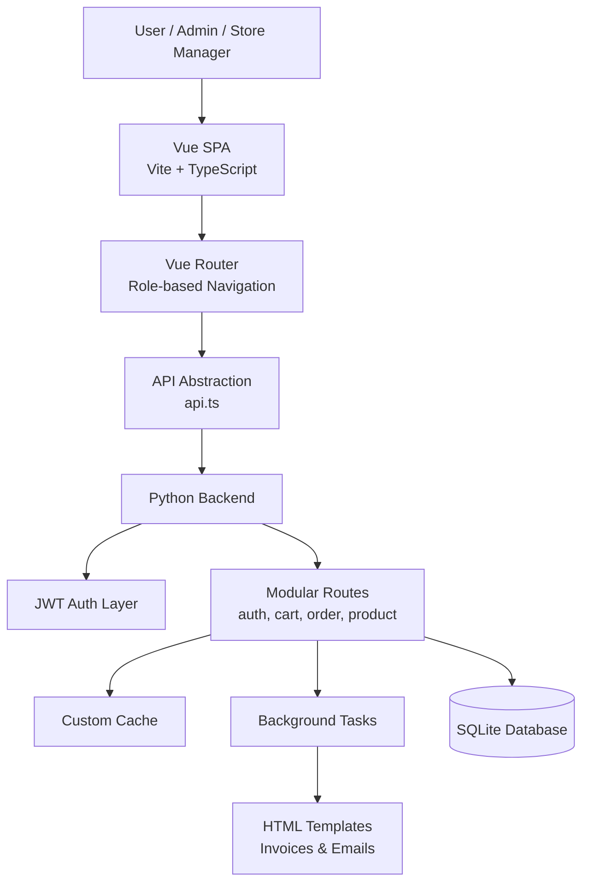

# GroceryStoreV2 🛒

A full-stack grocery store management system built with a **Python backend** and a
**modern SPA frontend**, designed to simulate real-world e-commerce workflows
such as inventory management, cart handling, order processing, reporting, and authentication.

This project emphasizes **backend architecture, data flow, and business logic**
over simple CRUD operations.

---

## 📌 Overview

**GroceryStoreV2** is a multi-module grocery store platform that supports:

- User authentication and authorization
- Product and category management
- Cart and order lifecycle
- Sales summaries and reports
- Background tasks and caching
- Server-generated documents (invoices, reports, emails)
- SPA-based frontend dashboards

The project is structured to resemble a **production-ready service**, not a demo app.

---

## 🧠 Architecture Diagram



## 🧠 High-Level Architecture

```text
Frontend (SPA)
 └─ Vue.js + Vite
     └─ Auth-aware routing
     └─ Role-based dashboards

Backend (API + Services)
 └─ Python (Flask-style architecture)
     ├─ REST APIs
     ├─ JWT Authentication
     ├─ Background Tasks
     ├─ Caching Layer
     ├─ Database (SQLite)
     ├─ HTML Templates
     └─ Reporting & Exports
```

## 🚀 Key Features

### Backend

* JWT-based authentication
* Role-based access (Admin / Store Manager / User)
* Product & category management
* Cart and order processing
* Background task execution
* Custom caching layer
* Sales analytics & summary endpoints
* CSV export support
* HTML email & invoice templates
* Database-backed persistence

### Frontend

* SPA built with Vue + TypeScript
* Route-based navigation
* Role-specific dashboards
* Authentication-aware UI
* Centralized API layer

---

## 🛠️ Tech Stack

### Backend

* Python
* Flask-style architecture
* SQLite (development database)
* JWT for authentication
* Background tasks
* Custom caching
* HTML templates for emails & invoices

### Frontend

* Vue.js
* TypeScript
* Vite
* Vue Router
* Modular component architecture

---

## 📁 Project Structure

```text
GroceryStoreV2
├── backend
│   ├── main.py
│   ├── requirements.txt
│   ├── instance/
│   │   └── grocery_store_v2.db
│   └── src/
│       ├── routes/          # API routes (auth, cart, product, order, etc.)
│       ├── models.py        # Database models
│       ├── jwt.py           # Auth & token handling
│       ├── custom_cache.py  # Caching layer
│       ├── tasks.py         # Background jobs
│       ├── utils.py         # Shared utilities
│       ├── templates/       # Emails & invoices
│       ├── exports/         # CSV exports
│       └── sales_report/    # Generated reports
│
└── frontend
    ├── src/
    │   ├── components/      # UI components
    │   ├── pages/           # Application pages
    │   ├── router.ts        # Route configuration
    │   ├── api.ts           # API abstraction
    │   └── App.vue
    └── package.json
```

---

## 🔐 Authentication & Authorization

* JWT-based authentication
* Tokens validated on protected routes
* Role-aware dashboards:

  * Admin
  * Store Manager
  * User

This ensures **separation of responsibilities** and secure access control.

---

## 🧩 Backend Highlights

### 🔹 Modular Route Design

Each business domain (auth, product, cart, order, summary) has its own route module,
keeping logic isolated and maintainable.

---

### 🔹 Background Tasks

Long-running or periodic operations (such as reports or reminders) are handled
outside request-response cycles.

---

### 🔹 Custom Caching Layer

Caching is introduced to reduce redundant computation and improve response times.

---

### 🔹 Reporting & Templates

* HTML templates for invoices and emails
* Auto-generated sales and category reports
* CSV exports for external analysis

---

## ▶️ Running the Project

### Backend

```bash
cd backend
pip install -r requirements.txt
python main.py
```

Backend runs on:

```
http://localhost:5000
```

---

### Frontend

```bash
cd frontend
npm install
npm run dev
```

Frontend runs on:

```
http://localhost:5173
```
