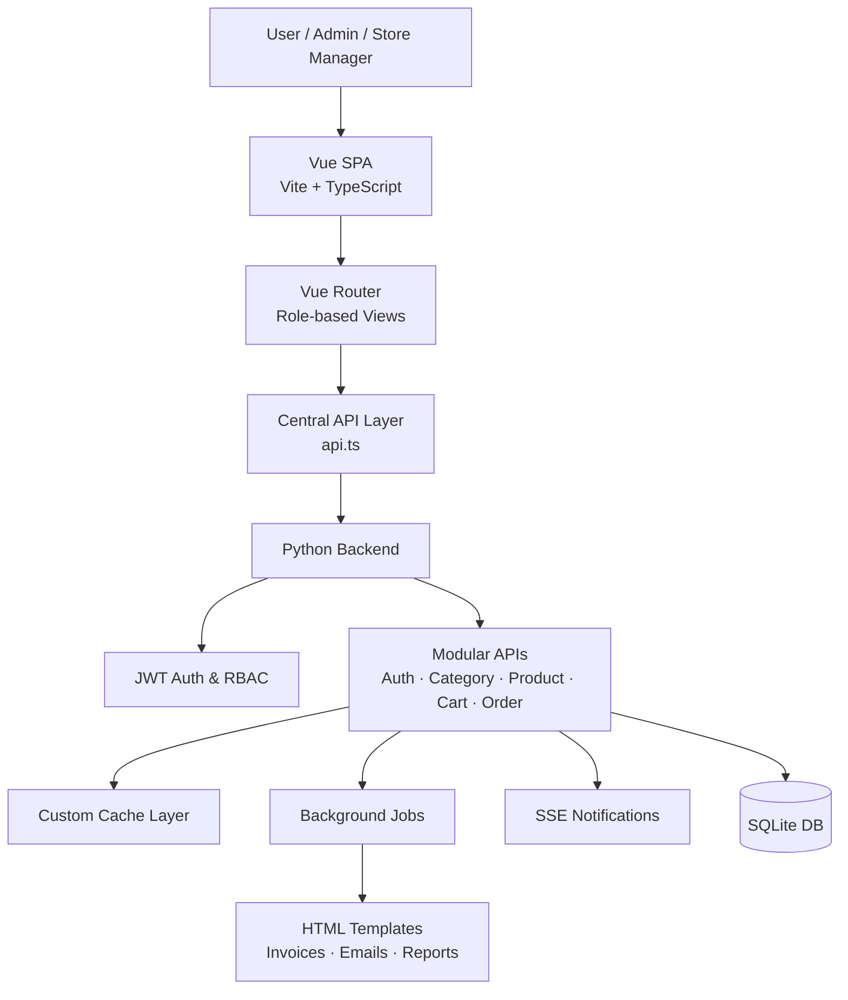

# GroceryStoreV2 🛒  
**Modern Full-Stack Grocery Store Management System**

GroceryStoreV2 is a **role-based, full-stack web application** built as part of  
**Modern Application Development – II (MAD-II)**.

It simulates a **real-world e-commerce grocery platform** with proper backend
architecture, role separation, background jobs, caching, reporting, and a modern
SPA frontend.

This project focuses on **business workflows and system design**, not just CRUD.

## 📌 Overview

GroceryStoreV2 supports **three user roles**:

- **Admin**
- **Store / Inventory Manager**
- **User (Customer)**

The system allows users to browse products, manage carts, place orders,
while admins and store managers manage inventory, categories, approvals,
and reports.

The application follows a **production-style architecture** with:
- JWT authentication
- Role-based access control (RBAC)
- Modular backend APIs
- Background tasks
- Real-time notifications
- Reporting & exports

> ⚠️ Note: Initial user setup requires a one-time manual database bootstrap.
> Please read the setup section before running the project.


## 🧠 Architecture Overview

The system follows a SPA + REST architecture where the frontend communicates
with a Python backend through authenticated APIs. Role-based access control,
background jobs, caching, and real-time notifications are handled server-side
to simulate production-grade workflows.

## 🧠 High-Level Architecture

```text
Frontend (SPA)
 └─ Vue.js + TypeScript + Vite
     ├─ Role-based dashboards
     ├─ Centralized API layer
     └─ SSE-based notifications

Backend (API + Services)
 └─ Python (Flask-style)
     ├─ JWT Authentication
     ├─ Modular REST APIs
     ├─ Custom caching
     ├─ Background jobs
     ├─ Email & invoice templates
     └─ SQLite database
```

## 🚀 Core Features

### 🔐 Authentication & Authorization

* JWT-based authentication
* Role-based access control (RBAC)
* Secure route protection on backend & frontend

**Roles:**

* Admin
* Store Manager
* User

### 🧑‍💼 Admin Capabilities

* Approve store manager accounts
* Create, edit, delete categories
* Approve / decline category change requests
* View all users and orders
* View monthly sales reports (product & category wise)
* Export product data as CSV

### 🏪 Store Manager Capabilities

* Add, update, delete products
* Request category creation, edit, or deletion
* Export product inventory as CSV
* View monthly sales reports
* Receive real-time notifications for approvals

### 🛒 User Capabilities

* Browse products across categories
* Search products by:

  * Name
  * Category
  * Description
  * Price
  * Manufacture / expiry date
* Add products to cart
* Modify cart quantities
* Place orders across multiple categories
* View order history
* Receive invoices via email

## 🔔 Real-Time Notifications (SSE)

Server-Sent Events (SSE) are used for:

* New product notifications
* Category approval / rejection alerts
* Stock availability updates
* Admin ↔ Store Manager communication

No polling — updates are pushed in real time.

## 🧩 Background Jobs & Reports

### ⏰ Scheduled Jobs

* **Daily reminder emails** to inactive users
* **Monthly sales reports** sent to admins & managers

### ⚙️ Async / Triggered Jobs

* Product CSV export
* Invoice email generation
* Sales report generation (charts)

## 📊 Reporting

* Product-wise monthly sales report
* Category-wise monthly sales report
* Auto-generated visual charts
* Downloadable CSV exports

## ⚙️ Caching Strategy

To improve performance:

* Frequently accessed data is cached
* Cache invalidation on updates
* Keeps the application responsive under load

> Redis is mentioned in the problem statement as a suggested tool.
> For portability and local execution, caching is implemented using
> a custom in-process cache while maintaining the same design principles.

## 🛠️ Tech Stack

### Backend

* Python
* Flask-style architecture
* Flask-RESTful
* JWT Authentication
* SQLite
* Server-Sent Events (SSE)
* Flask-Mail
* Custom caching
* Background jobs (async & scheduled)
* HTML templates (emails & invoices)

### Frontend

* Vue.js 3
* TypeScript
* Vite
* Vue Router
* Centralized API abstraction
* Role-based dashboards

## 📁 Project Structure

```text
GroceryStoreV2
├── backend
│   ├── main.py
│   ├── requirements.txt
│   ├── instance/
│   │   └── grocery_store_v2.db
│   └── src/
│       ├── routes/          # API routes (auth, cart, product, order, etc.)
│       ├── models.py        # Database models
│       ├── jwt.py           # Auth & token handling
│       ├── custom_cache.py  # Caching layer
│       ├── tasks.py         # Background jobs
│       ├── utils.py         # Shared utilities
│       ├── templates/       # Emails & invoices
│       ├── exports/         # CSV exports
│       └── sales_report/    # Generated reports
│
└── frontend
    ├── src/
    │   ├── components/      # UI components
    │   ├── pages/           # Application pages
    │   ├── router.ts        # Route configuration
    │   ├── api.ts           # API abstraction
    │   └── App.vue
    └── package.json
```

## ✅ Requirement Coverage (MAD-II)

| Requirement                    | Status        |
| ------------------------------ | ------------- |
| User / Admin / Manager RBAC    | ✅ Implemented |
| Category & Product Management  | ✅ Implemented |
| Category Approval Workflow     | ✅ Implemented |
| Search (price, date, category) | ✅ Implemented |
| Cart & Multi-Category Purchase | ✅ Implemented |
| Daily Reminder Job             | ✅ Implemented |
| Monthly Activity Report        | ✅ Implemented |
| CSV Export (Async)             | ✅ Implemented |
| Performance Caching            | ✅ Implemented |
| Real-Time Notifications        | ✅ Implemented |

## ⚠️ Initial Setup & User(Admin) Bootstrapping (Important)

This project was originally developed earlier and is now being preserved
as a **portfolio and academic reference project**.

For this reason, **automatic user creation via UI is not enabled by default**.
To run the application correctly, an initial user must be created manually.

This setup is intentional and documented clearly below.


## 🔐 Environment Configuration

Create a `.env` file inside:

```text
backend/src/.env
```
Add the following variables:

```env
FERNET_KEY=
SECRET_TOKEN_KEY=
APP_SECRET_KEY=

MAIL_SERVER=
MAIL_PORT=
MAIL_USERNAME=
MAIL_PASSWORD=
```


## 🔒 Password Encryption (Manual Bootstrap)

Passwords stored in the database are **encrypted using Fernet**.

Since initial users must be created manually, password encryption must be
performed **directly from the Python shell** using the same Fernet key
defined in the `.env` file.


### Step 1: Ensure Fernet Key Exists

Generate a Fernet key (only once):

```python
from cryptography.fernet import Fernet
Fernet.generate_key()
```
Add the generated key to `.env`:

```env
FERNET_KEY=<generated_key_here>
```


### Step 2: Continue in Python Shell and Create Fernet Instance

While still in the Python shell, initialize Fernet **using the same key**:

```python
from cryptography.fernet import Fernet
import os

FERNET_KEY = b"<paste_the_same_key_here>"
fernet = Fernet(FERNET_KEY)
```

> ⚠️ The key used here **must exactly match** the value stored in `.env`.


### Step 3: Encrypt the Password

Encrypt the plaintext password:

```python
encrypted_password = fernet.encrypt("password".encode())
```

The resulting value should be stored **as-is** in the database.


### Step 4: Insert Encrypted Password into Database

Open the SQLite database:

```text
backend/instance/grocery_store_v2.db
```

Insert a user record manually with:

* Encrypted password
* Appropriate role (`admin`)
* Active status enabled


### 🔑 Important Notes

* Password encryption is a **one-time bootstrap step**
* After user creation, the application handles authentication normally
* This approach preserves legacy security design without refactoring


## 📝 Note

This approach was chosen to:

* Preserve the original architecture
* Avoid refactoring legacy authentication flows
* Keep the project focused on backend architecture, RBAC, and workflows

All authentication, authorization, and role-based features work as expected
after the initial user is created.


## ▶️ Running the Project

### Backend

```bash
cd backend
pip install -r requirements.txt
python main.py
```

Runs at:

```
http://localhost:5000
```


### Frontend

```bash
cd frontend
npm install
npm run dev
```

Runs at:

```
http://localhost:4200
```


## 🧩 Design Decisions

* Used **SSE instead of polling** for real-time updates
* Centralized API handling on frontend for maintainability
* Custom caching to avoid external dependencies
* Clear separation of responsibilities using RBAC
* Designed backend to resemble a production service


## 📌 Notes

* The application is designed for **local execution** as required by MAD-II
* External services are intentionally minimized
* Focus is on **architecture, workflows, and system behavior**


## 📜 License

This project is developed for academic and learning purposes.


## 👨‍💻 Author

**Manmay**
Full-Stack Developer
