# GroceryStoreV2 🛒  
**Modern Full-Stack Grocery Store Management System**

GroceryStoreV2 is a **role-based, full-stack web application** built as part of  
**Modern Application Development – II (MAD-II)**.

It simulates a **real-world e-commerce grocery platform** with proper backend
architecture, role separation, background jobs, caching, reporting, and a modern
SPA frontend.

This project focuses on **business workflows and system design**, not just CRUD.

## 📌 Overview

GroceryStoreV2 supports **three user roles**:

- **Admin**
- **Store / Inventory Manager**
- **User (Customer)**

The system allows users to browse products, manage carts, place orders,
while admins and store managers manage inventory, categories, approvals,
and reports.

The application follows a **production-style architecture** with:
- JWT authentication
- Role-based access control (RBAC)
- Modular backend APIs
- Background tasks
- Real-time notifications
- Reporting & exports

> ⚠️ Note: Initial user setup requires a one-time manual database bootstrap.
> Please read the setup section before running the project.


## 🧠 Architecture Overview

```mermaid
flowchart TD
    U[User / Admin / Store Manager]

    FE[Vue SPA<br/>Vite + TypeScript]
    ROUTER[Vue Router<br/>Role-based Views]
    API[Central API Layer<br/>api.ts]

    BE[Python Backend]
    AUTH[JWT Auth & RBAC]
    ROUTES[Modular APIs<br/>Auth · Category · Product · Cart · Order]
    CACHE[Custom Cache Layer]
    TASKS[Background Jobs]
    SSE[SSE Notifications]
    DB[(SQLite DB)]
    TPL[HTML Templates<br/>Invoices · Emails · Reports]

    U --> FE
    FE --> ROUTER
    ROUTER --> API
    API --> BE

    BE --> AUTH
    BE --> ROUTES
    ROUTES --> CACHE
    ROUTES --> TASKS
    ROUTES --> SSE
    ROUTES --> DB
    TASKS --> TPL
```

The system follows a SPA + REST architecture where the frontend communicates
with a Python backend through authenticated APIs. Role-based access control,
background jobs, caching, and real-time notifications are handled server-side
to simulate production-grade workflows.

## 🧠 High-Level Architecture

```text
Frontend (SPA)
 └─ Vue.js + TypeScript + Vite
     ├─ Role-based dashboards
     ├─ Centralized API layer
     └─ SSE-based notifications

Backend (API + Services)
 └─ Python (Flask-style)
     ├─ JWT Authentication
     ├─ Modular REST APIs
     ├─ Custom caching
     ├─ Background jobs
     ├─ Email & invoice templates
     └─ SQLite database
```

## 🚀 Core Features

### 🔐 Authentication & Authorization

* JWT-based authentication
* Role-based access control (RBAC)
* Secure route protection on backend & frontend

**Roles:**

* Admin
* Store Manager
* User

### 🧑‍💼 Admin Capabilities

* Approve store manager accounts
* Create, edit, delete categories
* Approve / decline category change requests
* View all users and orders
* View monthly sales reports (product & category wise)
* Export product data as CSV

### 🏪 Store Manager Capabilities

* Add, update, delete products
* Request category creation, edit, or deletion
* Export product inventory as CSV
* View monthly sales reports
* Receive real-time notifications for approvals

### 🛒 User Capabilities

* Browse products across categories
* Search products by:

  * Name
  * Category
  * Description
  * Price
  * Manufacture / expiry date
* Add products to cart
* Modify cart quantities
* Place orders across multiple categories
* View order history
* Receive invoices via email

## 🔔 Real-Time Notifications (SSE)

Server-Sent Events (SSE) are used for:

* New product notifications
* Category approval / rejection alerts
* Stock availability updates
* Admin ↔ Store Manager communication

No polling — updates are pushed in real time.

## 🧩 Background Jobs & Reports

### ⏰ Scheduled Jobs

* **Daily reminder emails** to inactive users
* **Monthly sales reports** sent to admins & managers

### ⚙️ Async / Triggered Jobs

* Product CSV export
* Invoice email generation
* Sales report generation (charts)

## 📊 Reporting

* Product-wise monthly sales report
* Category-wise monthly sales report
* Auto-generated visual charts
* Downloadable CSV exports

## ⚙️ Caching Strategy

To improve performance:

* Frequently accessed data is cached
* Cache invalidation on updates
* Keeps the application responsive under load

> Redis is mentioned in the problem statement as a suggested tool.
> For portability and local execution, caching is implemented using
> a custom in-process cache while maintaining the same design principles.

## 🛠️ Tech Stack

### Backend

* Python
* Flask-style architecture
* Flask-RESTful
* JWT Authentication
* SQLite
* Server-Sent Events (SSE)
* Flask-Mail
* Custom caching
* Background jobs (async & scheduled)
* HTML templates (emails & invoices)

### Frontend

* Vue.js 3
* TypeScript
* Vite
* Vue Router
* Centralized API abstraction
* Role-based dashboards

## 📁 Project Structure

```text
GroceryStoreV2
├── backend
│   ├── main.py
│   ├── requirements.txt
│   ├── instance/
│   │   └── grocery_store_v2.db
│   └── src/
│       ├── routes/          # API routes (auth, cart, product, order, etc.)
│       ├── models.py        # Database models
│       ├── jwt.py           # Auth & token handling
│       ├── custom_cache.py  # Caching layer
│       ├── tasks.py         # Background jobs
│       ├── utils.py         # Shared utilities
│       ├── templates/       # Emails & invoices
│       ├── exports/         # CSV exports
│       └── sales_report/    # Generated reports
│
└── frontend
    ├── src/
    │   ├── components/      # UI components
    │   ├── pages/           # Application pages
    │   ├── router.ts        # Route configuration
    │   ├── api.ts           # API abstraction
    │   └── App.vue
    └── package.json
```

## ✅ Requirement Coverage (MAD-II)

| Requirement                    | Status        |
| ------------------------------ | ------------- |
| User / Admin / Manager RBAC    | ✅ Implemented |
| Category & Product Management  | ✅ Implemented |
| Category Approval Workflow     | ✅ Implemented |
| Search (price, date, category) | ✅ Implemented |
| Cart & Multi-Category Purchase | ✅ Implemented |
| Daily Reminder Job             | ✅ Implemented |
| Monthly Activity Report        | ✅ Implemented |
| CSV Export (Async)             | ✅ Implemented |
| Performance Caching            | ✅ Implemented |
| Real-Time Notifications        | ✅ Implemented |


## ⚠️ Initial Setup & Default Admin Creation

On first application startup, the database and tables are created automatically.

A **default admin user** is also created programmatically to bootstrap the system.
This avoids manual database manipulation and preserves consistent encryption logic.

### Default Admin Credentials

```text
Email: admin@admin.com
Password: admin
Role: admin
````

The password is securely encrypted using **Fernet encryption** with a key loaded
from environment variables.

> ⚠️ This user is created only if it does not already exist.


## 🔧 Required Services

### Redis (Mandatory)

This project uses **Celery with Redis** for background jobs such as:
- Email notifications
- Report generation
- Asynchronous tasks

Redis **must be running** before starting the backend.

#### Install Redis

**Linux (Ubuntu/Debian):**
```bash
sudo apt update
sudo apt install redis-server
sudo service redis-server start
````

**macOS (Homebrew):**

```bash
brew install redis
brew services start redis
```

**Windows:**

* Use WSL and install Redis inside Linux, **or**
* Use a Redis-compatible Windows service

Verify Redis is running:

```bash
redis-cli ping
# Expected output: PONG
```

This is **mandatory** — otherwise Celery will fail.


## 🔐 Environment Configuration

Create a `.env` file inside:

```text
backend/src/.env
```
Add the following variables:

```env
FERNET_KEY=
SECRET_TOKEN_KEY=
APP_SECRET_KEY=

MAIL_SERVER=
MAIL_PORT=
MAIL_USERNAME=
MAIL_PASSWORD=
```


### Fernet Key Generation

Generate once using Python:

```python
from cryptography.fernet import Fernet
Fernet.generate_key()
```

Paste the generated key into `FERNET_KEY` of `.env`.


## ▶️ Running the Project

### Backend

Ensure **Redis is running**, then:

```bash
cd backend
pip install -r requirements.txt
python main.py
````

On first run, you should see:

```text
Database initialized!
Default Admin created
```

Backend runs at:

```text
http://localhost:5000
```


### Frontend

```bash
cd frontend
npm install
npm run dev
```

Runs at:

```
http://localhost:4200
```


## 🧩 Design Decisions

* Used **SSE instead of polling** for real-time updates
* Centralized API handling on frontend for maintainability
* Custom caching to avoid external dependencies
* Clear separation of responsibilities using RBAC
* Designed backend to resemble a production service


## 📌 Notes

* The application is designed for **local execution** as required by MAD-II project from `IIT Madras` **BS Degree Program**
* External services are intentionally minimized
* Focus is on **architecture, workflows, and system behavior**


## 📜 License

This project is developed for academic and learning purposes.


## 👨‍💻 Author

**Manmay**
Full-Stack Developer
